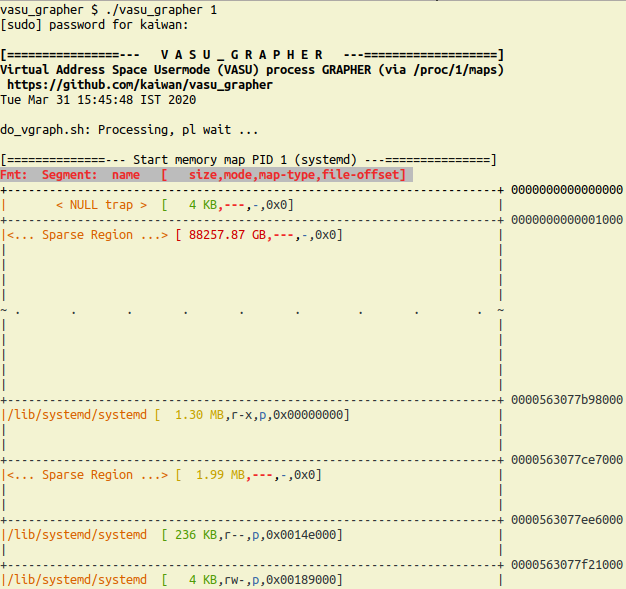
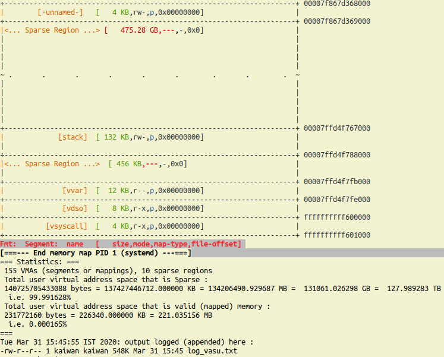

# vasu_grapher
*VASU = Virtual Address Space Usermode*. **A simple console/CLI utility to "graph" (visualize) the Linux user mode process VAS, in effect, the userspace memory map**.

A simple visualization (in a vertically-tiled format) of the userspace memory map of a given process. It works by iterating over the /proc/PID/maps pseudo-file of a given process. It color-codes and shows the following details (comma separated) for each segment (or mapping):
 - the start user virtual address (uva) to the right extreme of the line seperator
 - the segment name
 - it's size (appropriately, in KB/MB/GB)
 - it's mode (permissions; highlights if null or .WX for security)
 - the type of mapping (p=private, s=shared)
 - if a file mapping, the offset from thebeginning of the file (0x0 for anonymous or starts at BOF)

To aid with visualization of the process VAS, we show the relative "length" of a segment (or mapping) via it's height. The script works on both 32 and 64-bit Linux OS (lightly tested, request more testing and bug/issue reports please).

As an example, below, we run our script on process PID 1 on an x86_64 Ubuntu 18.04 Linux box, and
display partial screenshots of the beginning and end of the output:

[...]

**Note-**
- As of now, we also show some statistics when done- the amount and percentage of memory in the total VAS that is just 'sparse' (empty; on 64-bit systems it can be very high!) vs the actually used memory amount and percentage.

- Currently, at the end of the 'graph', the memory above the usermode addr space is shown as a 'sparse' region; in reality, on 32-bit systems, this is the kernel VAS! ... and on 64-bit systems, this _is_ sparse space (huge), followed by the kernel VAS. I shall work on updating this as such..

- As a bonus, the output is logged - appended - to the file log_vasu.txt. Look up this log when done.

*Okay, the same (well, similar) output in plain text follows below:*

$ ./vasu_grapher 1
[sudo] password for [whomever]: xxxxxxxxx

[================---   V A S U _ G R A P H E R   ---===================]
Virtual Address Space Usermode (VASU) process GRAPHER (via /proc/1/maps)
 https://github.com/kaiwan/vasu_grapher
Tue Mar 31 15:45:48 IST 2020

do_vgraph.sh: Processing, pl wait ...

[==============--- Start memory map PID 1 (systemd) ---===============]
Fmt:  Segment:  name   [   size,mode,map-type,file-offset] 
+----------------------------------------------------------------------+ 0000000000000000
|       < NULL trap >  [   4 KB,---,-,0x0]                             |
+----------------------------------------------------------------------+ 0000000000001000
|<... Sparse Region ...> [ 88257.87 GB,---,-,0x0]                      |
|                                                                      |
|                                                                      |
|                                                                      |
|                                                                      |
~ .       .       .       .       .       .        .       .        .  ~
|                                                                      |
|                                                                      |
|                                                                      |
|                                                                      |
|                                                                      |
+----------------------------------------------------------------------+ 0000563077b98000
|/lib/systemd/systemd [  1.30 MB,r-x,p,0x00000000]                     |
|                                                                      |
|                                                                      |
+----------------------------------------------------------------------+ 0000563077ce7000
|<... Sparse Region ...> [  1.99 MB,---,-,0x0]                         |
|                                                                      |
|                                                                      |
+----------------------------------------------------------------------+ 0000563077ee6000
|/lib/systemd/systemd  [ 236 KB,r--,p,0x0014e000]                      |
|                                                                      |
+----------------------------------------------------------------------+ 0000563077f21000
|/lib/systemd/systemd  [   4 KB,rw-,p,0x00189000]                      |

[...]

+----------------------------------------------------------------------+ 00007f867d368000
|        [-unnamed-]   [   4 KB,rw-,p,0x00000000]                      |
+----------------------------------------------------------------------+ 00007f867d369000
|<... Sparse Region ...> [   475.28 GB,---,-,0x0]                      |
|                                                                      |
|                                                                      |
|                                                                      |
|                                                                      |
~ .       .       .       .       .       .        .       .        .  ~
|                                                                      |
|                                                                      |
|                                                                      |
|                                                                      |
|                                                                      |
+----------------------------------------------------------------------+ 00007ffd4f767000
|             [stack]  [ 132 KB,rw-,p,0x00000000]                      |
|                                                                      |
+----------------------------------------------------------------------+ 00007ffd4f788000
|<... Sparse Region ...>  [ 456 KB,---,-,0x0]                          |
|                                                                      |
+----------------------------------------------------------------------+ 00007ffd4f7fb000
|              [vvar]  [  12 KB,r--,p,0x00000000]                      |
+----------------------------------------------------------------------+ 00007ffd4f7fe000
|              [vdso]  [   8 KB,r-x,p,0x00000000]                      |
+----------------------------------------------------------------------+ ffffffffff600000
|          [vsyscall]  [   4 KB,r-x,p,0x00000000]                      |
+----------------------------------------------------------------------+ ffffffffff601000
Fmt:  Segment:  name   [   size,mode,map-type,file-offset] 
[===--- End memory map PID 1 (systemd) ---===]
=== Statistics: ===
 155 VMAs (segments or mappings), 10 sparse regions
 Total user virtual address space that is Sparse :
 140725705433088 bytes = 137427446712.000000 KB = 134206490.929687 MB =  131061.026298 GB =  127.989283 TB
  i.e. 99.991628% 
 Total user virtual address space that is valid (mapped) memory :
 231772160 bytes = 226340.000000 KB = 221.035156 MB
  i.e. 0.000165%
===
Tue Mar 31 15:45:55 IST 2020: output logged (appended) here :
-rw-r--r-- 1 kaiwan kaiwan 548K Mar 31 15:45 log_vasu.txt
$ 

[End doc]
